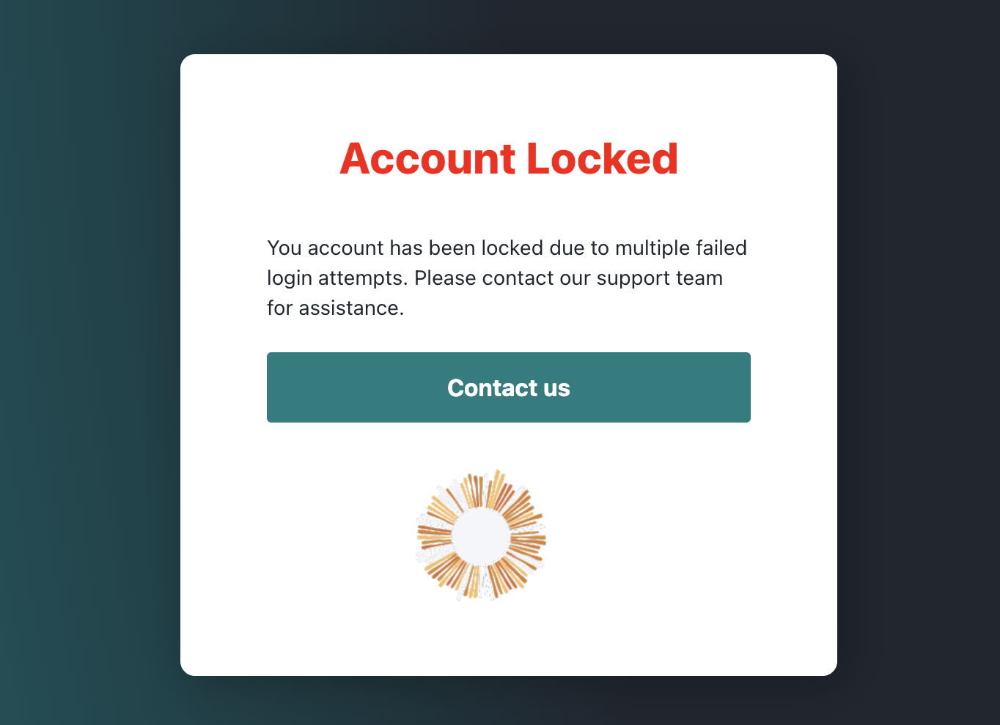

# Management Commands

## Resetting login attempts and lockouts

Climweb uses [Django Axes](https://django-axes.readthedocs.io/en/latest/) to manage login attempts and lockouts.

An account is locked when a user has failed to login too many times.



This means that the instructions on Django Axes' documentation for resetting login attempts and lockouts are applicable
to Climweb as well.

When Axes locks an IP address, it is not allowed to login again. You can allow IPs to attempt again by resetting (
deleting) the relevant AccessAttempt records in the admin UI, or Command Line Interface (CLI).

### Resetting attempts from the Django admin UI

Records can be easily deleted by using the Django admin application.

Go to the django admin UI and check the Access Attempt view. Select the attempts you wish the allow again and simply
remove them. The blocked user will be allowed to log in again in accordance to the rules.

On Climweb, the default URL path for the Django admin UI is `/dj-ad-admin/`. This can be changed in the settings file
using the variable `DJANGO_ADMIN_URL_PATH`.

### Resetting attempts from the CLI

Django Axes offers a command line interface with `axes_reset`, `axes_reset_ip`, `axes_reset_username`, and
`axes_reset_ip_username` management commands with the Django manage.py or django-admin command helpers:

- `python manage.py axes_reset` will reset all lockouts and access records.
- `python manage.py axes_reset_ip [ip ...]` will clear lockouts and records for the given IP addresses.
- `python manage.py axes_reset_username [username ...]` will clear lockouts and records for the given usernames.
- `python manage.py axes_reset_ip_username [ip] [username]` will clear lockouts and records for the given IP address and
  username.
- `python manage.py axes_reset_logs` (age) will reset (i.e. delete) AccessLog records that are older than the given age
  where the default is 30 days.

### Resetting attempts from the CLI in a Climweb Docker Compose environment

On a production Climweb instance, to clear all lockouts and access records, run the following command:

```bash
cd climweb

docker compose exec climweb /bin/bash climweb axes_reset
```

This is a shorthand command that does the following:

- `cd climweb` changes the working directory to the Climweb project directory.
- `docker compose exec climweb /bin/bash` runs a bash shell in the `climweb` container.
- `climweb axes_reset` runs the `axes_reset` command in the Climweb container.


