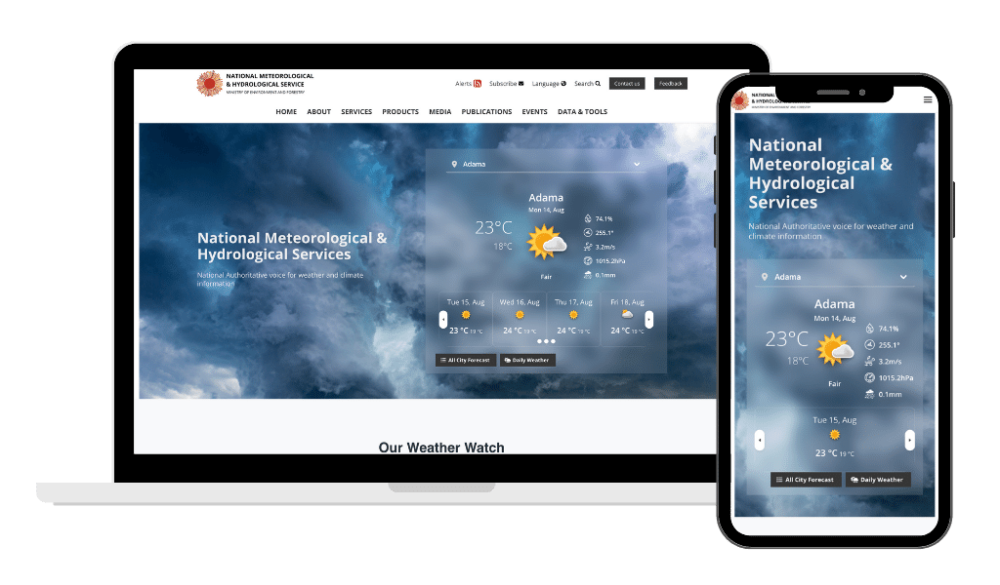

:hidetoc: 1

Welcome to ClimWeb documentation
==================================

Downloadable pdf versions can be found at:

.. admonition:: To download the PDF version of this guide use
   
   * :download:`ClimWeb Manual (English) <https://climweb.readthedocs.io/_/downloads/en/latest/pdf/>`
   * :download:`ClimWeb Manual (French) <https://climweb.readthedocs.io/_/downloads/fr/latest/pdf/>`
   * :download:`ClimWeb Manual (Swahili) <https://climweb.readthedocs.io/_/downloads/sw/latest/pdf/>`

ClimWeb
---------

.. toctree::
   :maxdepth: 2
   :titlesonly:

   _docs/Home
   _docs/Rationale
   _docs/Technology
   _docs/Piloting
   _docs/Find-Your-Way-Around
   _docs/manage_pages/index
   _docs/manage_settings/index
   _docs/manage_content_assets/index
   _docs/manage_cap/index
   _docs/Manage-City-Forecasts
   _docs/Manage-Mapviewer
   _docs/Atlas
   _docs/Mailing-Integrations
   _docs/Frequently-Asked-Questions
   _docs/technical/index
   
   

